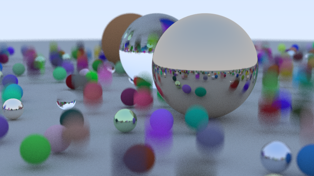

# Ray-Tracer
A simple Ray Tracer, using path tracing and written in Rust.

## About
This project is based on [the book series by Peter Shirley, *Ray Tracing in One Weekend*](https://raytracing.github.io/books/RayTracingInOneWeekend.html). It is nevertheless using C++ as a main language, so I adapted the original code snippets to Rust.



## Running
Run the current code from the project's root with the following commands:
```console
$ cd app 
$ cargo run --release
```

## License
This work is licensed under the [CC-BY-NC-SA 4.0](https://creativecommons.org/licenses/by-nc-sa/4.0/) license.